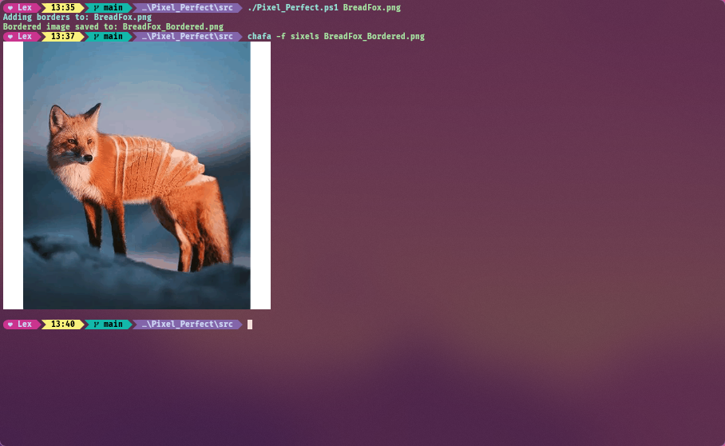

# Pixel Perfect

Pixel Perfect is a small powershell script that adds white borders to the edges of images to make them perfectly square.
Multiple images can be given borders at once by adding a comma between each image path.
(Requires ImageMagick to be installed on your system)

# Usage Example

### Input Image

### Output Image

